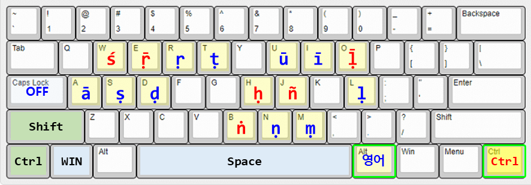
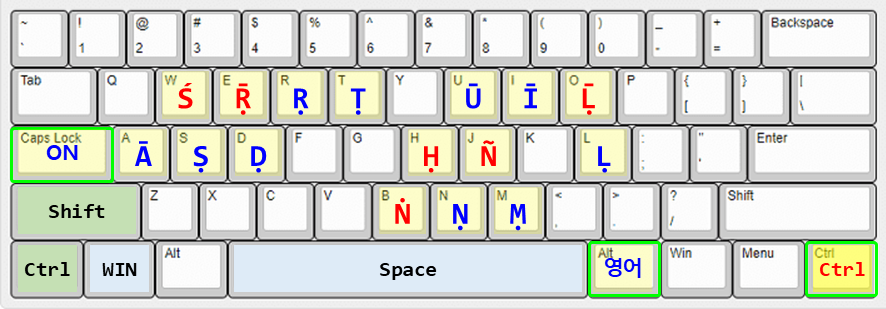
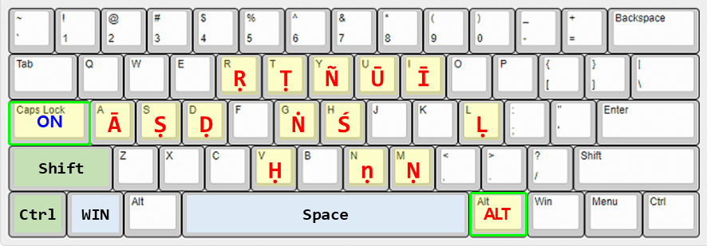
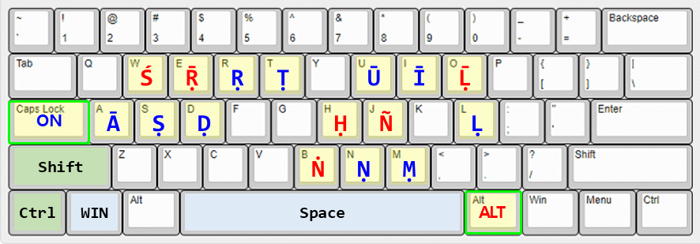

<div align="center">

# 🌍 IMEPali

### I'm e-Pali that help keyboard inputs of Pali and Sanskrit

### IME 설치없이 영어 입력모드에서 한자키로 Pali/Sanskrit 입력 지원


</div>

<br>

## 💡 개발 동기 (Why IMEPali?)

#### 🎯 1. IMEPointer 앱개발 경험 살려서 Pali어 전용앱 개발

> "IMEPointer에는 Pali어, 일본어, 공학용 특수기호 등 다양한 입력모드와 입력모드에 따라 컬러 포인터를 지원하지만 좀더 단순한 앱이 필요하지 않을까?"

- **기존 문제**: IMEPointer 앱에서는 영어 소문자와 한글CAPS 모드를 한자키로 전환하면서 영어와 Pali어를 번갈아 가면서 입력해야 했고, 지원하는 언어와 기능이 많아서, 처음 사용하기에는 어렵게 느껴질 수 있다.

- **새로운 활용**: 영어 입력모드에서 한자키를 이용하여 Pali어 입력과 전환키 기능을 지원하고, 불필요한 기능을 제거하여 Pali어 입력 전용 앱을 만듦.

- **효과**: 영어와 Pali어를 동일한 입력 모드에서 사용할 수 있다. 

#### 🎯 2. 초기 불교 문헌 연구 지원

> "기존 Pali어 자판이 있으나, Sanskrit까지 포함한 글자판이 있다면 초기불교 문헌 정리에 도움이 될 것 같다."

- **Pali어 + Sanskrit**: Pali 문자 (ā, ī, ū, ṛ, ḷ, ṃ, ṇ, ṭ, ḍ, ś, ṣ, ḥ) + Sanskrit 문자 (ṝ, ḹ) + 빈 문자에 인문학 특수기호 배치

- **효과**: 빨리 경전 및 산스크리트 텍스트 직접 입력 가능

- **대상**: Pali/Sanskrit 언어학자, 초기불교 연구자, 고전 문헌 전문가


<br>

## ✨ 주요 기능 (Key Features)

### 1️⃣ 영어 입력 모드에서 Pali어와 Sanskrit어 입력 가능

- **한자키** (RCtrl): Pali어 입력 및 선택 문자 전환 기능

<div align="center">

| 문자 입력상태 | 아이콘 색상 | 트레이 문자 | NOTE |
|:---|:---|:---:|:---|
| **한글** | $\color{white}\Large\blacktriangle$ White | $\color{gray}\large\textbf{P}$ | 한글 입력 모드 |
| **영어/Pali** | $\color{orange}\Large\blacktriangle$ Orange | $\color{orange}\large\textbf{P}$ | 영어 모드에서 Pali(한자키) 입력가능 |

</div>


### 2️⃣ Pali어 키보드 배열창을 실시간으로 표시

- 트레이 메뉴에서 **Pali어 키보드 배열창** 선택시, 키보드 배열 그림을 보여줌 (Always On Top)

- CAPS Lock On/Off 반응하여 대문자/소문자 키보드 배열 그림 변경

- 키보드 배열 그림을 double click하면 대문자/소문자 전환됨

### 3️⃣ 입력문자 표시창으로 문자 입력확인 및 학습보조

- 트레이 메뉴에서 **Pali어 입력문자 표시창** 선택시, 키보드로 입력한 문자를 화면에 표시

- 한자키 같이 눌러서 입력한 Pali글자 표시

- 선택한 글자를 한자키로 전환기능 사용시 글자전환 표시

### 4️⃣ 트레이 아이콘 **클릭**하여 메뉴 선택하고, 옵션 On/Off

<div align="center">


</div>

<br>

## 💡 Pali어 / Sanskrit 키보드 설치 및 사용팁 (Tips)

### 1️⃣ 한글CAPS Pali_Sanskrit 사용 (IMEPali 앱 제공 수정 Pali 자판)

1. Pali-Sanskrit(Unicode) 키보드 IME 설치 불필요.

2. 기존 Pali어 문자에 Sanskrit 전용 문자(**ṝ**, **ḹ**)를 추가함.

3. 유사한 문자끼리 직관적인 위치로 문자를 재배치함.

4. 한자키와 영어 문자를 동시 입력하여 Pali어 문자를 입력함.

<div align="center">




</div>

5. 한자키로 선택글자 전환기능 제공 : 선택된 글자가 다음 순서로 순환한다.

- 한자키와 영어문자를 동시에 눌러서 Pali 문자 입력후 한자키를 다시 누르면 해당 문자가 아래 표와 같이 전환된다.

- 다수의 글자를 선택하고 PE키를 누르면, 첫번째 글자의 전환과 동일한 전환이 적용된다.

- None(영어) → Dot below → Macron → Dot below+Macron → Dot above → Accent → Tilde  → None (영어)

<div align="center">

|None|Dot_below|Macron|Dot_below+Macron|Dot_above|Accent|Tilde|
|:---:|:---:|:---:|:---:|:---:|:---:|:---:|
|**a**|-|**ā**|-|-|-|-|
|**d**|**ḍ**|-|-|-|-|-|
|**h**|**ḥ**|-|-|-|-|-|
|**i**|-|**ī**|-|-|-|-|
|**l**|**ḷ**|-|**ḹ**|-|-|-|
|**m**|**ṃ**|-|-|-|-|-|
|**n**|**ṇ**|-|-|**ṅ**|-|**ñ**|
|**t**|**ṭ**|-|-|-|-|-|
|**u**|-|**ū**|-|-|-|-|
|**r**|**ṛ**|-|**ṝ**|-|-|-|
|**s**|**ṣ**|-|-|-|**ś**|-|

</div>

### 2️⃣ US+Pali Unicode IME (기존 Pali 자판)

* US+Pali(Unicode) IME 설치 : `https://www.tipitaka.org/keyboard.html`

* 한국어(MS IME) ↔ Pali 빠른 전환 : $\color{lime}\textbf{Ctrl}$ + $\color{lime}\textbf{Shift}$

* 자판 목록에서 순환 선택 : $\color{deepskyblue}\textbf{WIN}$ + $\color{deepskyblue}\textbf{Space}$

* Pali 문자 입력 : $\color{red}\textbf{한/영키}$ (Right Alt) + ($\color{red}\textbf{A, S, D, R, T, Y, U, I, G, H, L, M, N}$)

* 문제점 : 한영키(RAlt)가 Pali어 입력에 한글을 입력하려면 한글 IME로 전환해야 함. 

<div align="center">



</div>

### 3️⃣ Pali-Sanskrit Unicode IME (수정 Pali 자판)

* Pali-Sanskrit(Unicode) 키보드 설치 : [palisans_unicode.zip](https://github.com/stonkim93/IMEPali/palisans_unicode.zip)

* 기존 Pali어 문자에 Sanskrit 전용 문자(**ṝ**, **ḹ**)를 추가함.

* 유사한 문자끼리 직관적인 위치로 문자를 재배치함.

* IMEPali앱과 동일한 배열의 자판이지만, 설치가 필요하고, 사용법이 다름. 

* US+Pali(Unicode) IME와 설치방법 및 사용방법은 동일함.

* 문제점 : 한영키(RAlt)가 Pali어 입력에 한글을 입력하려면 한글 IME로 전환해야 함. 

<div align="center">



</div>

### 4️⃣ 아래한글에서 윈도우 MS IME 사용하기

> 📌 [TIP]
> 한글과컴퓨터의 자체 입력기 대신 Microsoft IME를 사용하도록 전환하면, 아래한글에서도 IMEPali가 입력 상태를 정확히 표시합니다.

* 아래한글 실행 후 상단 메뉴에서 `도구 ➔ 글자판 ➔ 글자판 바꾸기` 클릭 (단축키: <kbd>Alt</kbd> + <kbd>F2</kbd>)

* **글자판 바꾸기** 창에서 현재 글자판을 **한국어** 대신 $\color{lime}\textbf{윈도우\ 입력기}$로 변경

* **글자판 자동 변경** 해제하여 항상 윈도우 설정을 따르도록 저장

* 트레이 아이콘을 클릭하여 **엑셀/한글 작은원 표시**가 체크되면, 입력 상태를 시각적으로 구분하기 쉬움

### 5️⃣ 윈도우 시작 프로그램에 추가하기

* 윈도우 실행창(run)을 띄운다 : <kbd>WIN</kbd> + <kbd>R</kbd>

* 윈도우 시작프로그램 폴더를 연다 : `shell:startup`

* IMEPali.exe 바로가기 파일을 생성하여 시작프로그램 폴더에 붙여넣는다

* IMEPali 실행 후 숨겨진 아이콘 박스에 포함된 경우, 작업표시줄로 끄집어내어 MS IME 옆에 놓으면 시각적으로 도움이 된다


### 6️⃣ 한글자음+한자키 특수기호 입력하기

- ㄱ + 한자키 : 문장 부호 (', ", ·, ㆍ 등)

- ㄴ + 한자키 : 괄호 기호 ([, ], 「, 」 등)

- ㄷ + 한자키 : 수학 기호 (+, -, ×, ÷, = 등)

- ㄹ + 한자키 : 단위 기호 (㎜, ㎝, ㎤, ㎡ 등)

- ㅁ + 한자키 : 도형 기호 (★, ☎, ◀, ◆ 등)

- ㅂ + 한자키 : 선 기호 (│, ─, ┼ 등)

- ㅅ + 한자키 : 괄호 문자 (㉠,㈀)

- ㅇ + 한자키 : 원 숫자/영어, 괄호 숫자/영어 (ⓐ, ①, ⒜, ⑴)

- ㅈ + 한자키 : 아리비아 숫자, 로마 숫자 (1, 2, Ⅰ, Ⅱ 등)

- ㅊ + 한자키 : 분수, 위첨자/아래첨자 숫자 (½,¹, ₁)

- ㅋ + 한자키 : 현대한글 자음/모음 (ㄲ,ㄶ,ㅐ,ㅚ)

- ㅌ + 한자키 : 훈민정음 자음/모음 (ㅸ,ㆆ,ㅿ,ㆎ,ㆇ)

- ㅎ + 한자키 : 그리스 문자 (Δ, Ω, α, β 등)

<br>

## 🏃 초보 개발자를 위한 정보

### ⚙️ 요구 사항

| 항목 | 내용 |
|:---|:---|
| 🖥️ **OS** | Windows 10 / Windows 11 (64-bit) |
| 🧩 **Runtime** | [.NET 10.0 Desktop Runtime](https://dotnet.microsoft.com/download/dotnet/10.0) 이상 |
| ⌨️ **Language** | C# 12 / 13 |
| 🛠️ **IDE** | Visual Studio 2022 / 2026 |

### 1️⃣ 레포지토리 클론

```bash

git clone https://github.com/stonkim93/IMEPali.git

```

### 2️⃣ 빌드 & 배포판 만들기

Visual Studio에서 `IMEPali.csproj`를 열고 빌드합니다.


#### 프레임워크 의존형 (소용량)

```bash

dotnet publish -c Release -r win-x64 --self-contained false /p:PublishSingleFile=true

```

#### .net10 런타임 포함형 (대용량)

```bash

dotnet publish -c Release -r win-x64 --self-contained true /p:PublishSingleFile=true /p:IncludeNativeLibrariesForSelfExtract=true

```

### 3️⃣ 실행 파일 다운로드

오른쪽의 **[Releases]** 탭에서 최신 버전의 [IMEPali.zip](https://github.com/stonkim93/IMEPali/releases/download/IMEPali/IMEPali.zip) 파일을 다운로드 하고 압축을 해제합니다.

### 4️⃣ 실행하기

`IMEPali.exe`를 실행하면 시스템 트레이에서 즉시 작동합니다.

> 📌 [IMPORTANT]
> IMEPali 앱과 IMEPointer 앱에 대해 중복 실행 방지(`Mutex`)가 내장되어 있어 안전하게 백그라운드에서 상주합니다.

<br>

## ⚡ 기술적 특징 및 최적화 (Technical Highlights)


<br>


## 💡 몇가지 기술적 난제들

- 아래의 기술적 난제에 대해 도움을 요청합니다.

⚠️ Caps Lock On시 Shift 없이 해당 기호 입력


## ❤️ 개발 후기 및 감사의 글

💬 GitHub Issues를 통해 버그 리포트, 기능 제안, 풀 리퀘스트를 환영합니다!

- VS code를 사용했습니다.

- Coding & Debugging에는 Gemini 3.1 Pro (무료)의 도움을 많이 받았습니다.

- 키보드 배열 검토와 아이콘 생성에는 Claude Haiku 4.5 (무료)를 활용했습니다. 


## 📜 라이선스 (License)

- 이 프로젝트는 **MIT License**에 따라 자유롭게 수정 및 배포할 수 있습니다.

<br>

❤️🌍✨⚡🚀💡🎯🆕🖥️💻⌨️🔤🎨🧩🐛🔹📐📝✅🏆ℹ️❓
