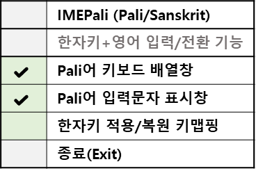
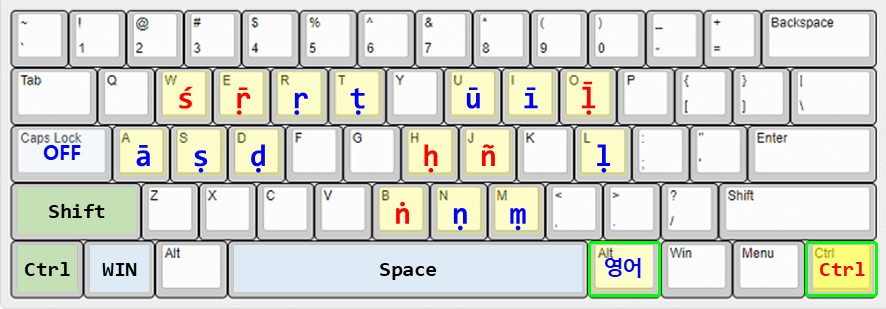
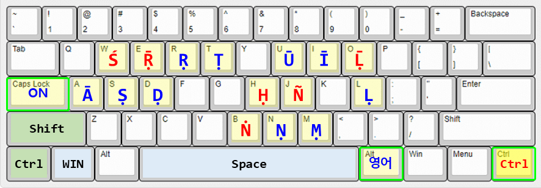
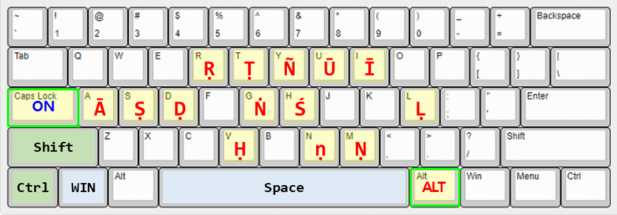
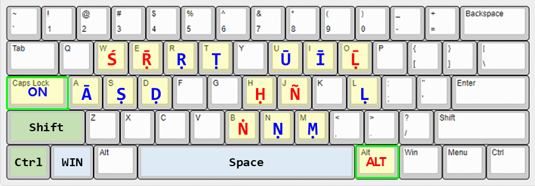
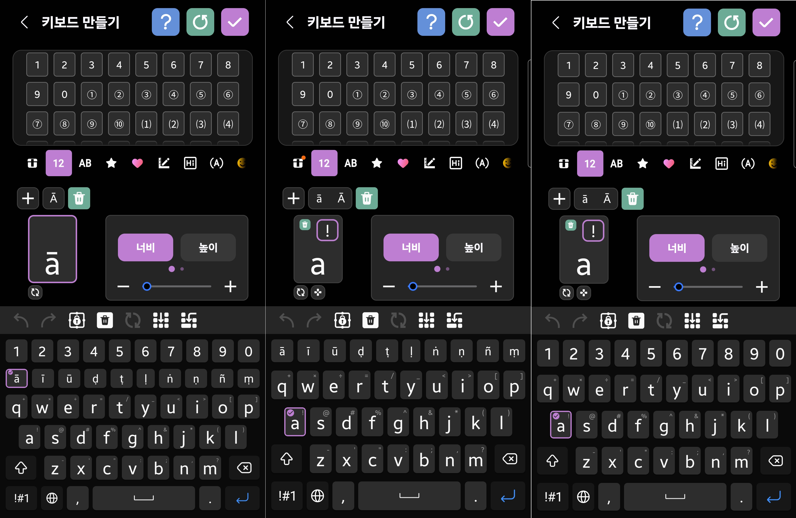

<div align="center">

# 🌍 IMEPali

### I'm e-Pali that helps keyboard inputs of Pali and Sanskrit.

### IME 설치없이 영어 입력모드에서 한자키로 Pali/Sanskrit 입력 지원


</div>

<br>

## 💡 개발 동기 (Why IMEPali?)

#### 🎯 1. IMEPointer 앱개발 경험 살려서 Pali어 전용앱 개발

> "IMEPointer에는 Pali어, 일본어, 공학용 특수기호 등 다양한 입력모드와 입력모드에 따라 컬러 포인터를 지원하지만 좀더 단순한 앱이 필요하지 않을까?"

- **기존 앱의 문제**: IMEPointer 앱에서는 영어 소문자와 한글CAPS 모드를 한자키로 전환하면서 영어와 Pali어를 번갈아 가면서 입력해야 했고, 지원하는 언어와 기능이 많아서, 처음 사용하기에는 어렵게 느껴질 수 있다.

- **새로운 활용**: 영어 입력모드에서 한자키를 이용하여 Pali어 입력과 전환키 기능을 지원하고, 불필요한 기능을 제거하여 Pali어 입력 전용 앱을 만듦.

- **효과**: 영어와 Pali어를 동일한 입력 모드에서 사용할 수 있다. 

#### 🎯 2. 초기 불교 문헌 연구 지원

> "기존 Pali어 자판이 있으나, Sanskrit까지 포함한 글자판이 있다면 초기불교 문헌 정리에 도움이 될 것 같다."

- **Pali어 + Sanskrit**: Pali 문자 (ā, ī, ū, ṛ, ḷ, ṃ, ṇ, ṭ, ḍ, ś, ṣ, ḥ) + Sanskrit 문자 (ṝ, ḹ)

- **효과**: 빨리 경전 및 산스크리트 텍스트 직접 입력 가능

- **대상**: Pali/Sanskrit 언어학자, 초기불교 연구자, 고전 문헌 전문가


<br>

## ✨ 주요 기능 (Key Features)

### 1️⃣ 영어 입력 모드에서 Pali어와 Sanskrit어 입력 가능

- **한자키** (RCtrl): Pali어 입력 및 선택 문자 전환 기능

<div align="center">

| 문자 입력상태 | 아이콘 색상 | 트레이 문자 | NOTE |
|:---|:---|:---:|:---|
| **한글** | $\color{white}\Large\blacktriangle$ White | $\color{gray}\large\textbf{P}$ | 한글 입력 모드 |
| **영어/Pali** | $\color{orange}\Large\blacktriangle$ Orange | $\color{orange}\large\textbf{P}$ | 영어 모드에서 한자키로 Pali어 입력 |

</div>


### 2️⃣ Pali어 키보드 배열 그림을 보고 자판을 쉽게 익힌다.

- 트레이 메뉴에서 **Pali어 키보드 배열창** 선택시, 키보드 배열 그림을 보여줌 (Always On Top)

- CAPS Lock On/Off 반응하여 대문자/소문자 키보드 배열 변경됨

- 키보드 배열 그림을 double click하면 대문자/소문자 배열 전환됨

- 키보드 배열 그림창을 작업표시줄로 최소화 했다가, 보고 싶을 때 다시 원래 크기와 위치로 복귀

- 키보드 배열 그림창을 닫으면 트레이 메뉴에서 해당 옵션이 해제됨

### 3️⃣ 입력문자 표시창으로 문자 입력확인 및 학습보조

- 트레이 메뉴에서 **Pali어 입력문자 표시창** 선택시, 키보드로 입력한 문자를 화면에 표시

- 한자키 같이 눌러서 입력한 Pali어 글자 표시함

- 선택한 글자를 한자키로 전환기능 사용시 글자의 전환을 표시함

### 4️⃣ 삼성전자 갤럭시북5 Copilot키의 한자키 적용/복원 키맵핑 기능 제공

### 5️⃣ 트레이 아이콘 **클릭**하여 메뉴 선택하고, 옵션 On/Off

<div align="center">



</div>

<br>

## 💡 Pali어 / Sanskrit 키보드 설치 및 사용팁 (Tips)

### 1️⃣ Pali_Sanskrit 사용 (IMEPali 앱 제공 수정 Pali 자판)

1. Pali-Sanskrit(Unicode) 키보드 IME 설치 불필요.

2. 기존 Pali어 문자에 Sanskrit 전용 문자(**ṝ**, **ḹ**)를 추가함.

3. 유사한 문자를 직관적인 위치의 키로 재배치함.
   Below_dot 글자를 영어글자 기본 위치에 배치하고, above_dot 또는 macron 글자를 해당 영어글자의 위쪽이나 앞쪽에 배치함.

<div align="center">




</div>

4. 한자키와 영어 문자를 동시 입력하여 Pali어 문자를 입력함.

5. 한자키로 입력문자 전환기능 제공

- 한자키와 영어문자를 동시에 눌러서 Pali 문자를 입력한 후에, 한자키를 다시 누르면 해당 문자가 아래 순서로 전환된다.

- 영어를 입력하고 한자키를 누르면, 해당 문자가 아래 표의 순서로 전환된다.

- 하나의 문자를 선택하고 한자키를 누르면, 해당 문자가 아래 표의 순서로 젆환된다.

- 다수의 글자를 선택하고 한자키를 누르면, 첫번째 글자가 전환되는 유형의 글자로 다른 글자들도 전환된다.

- None(영어) → Dot below → Macron → Dot below+Macron → Dot above → Accent → Tilde  → None (영어)

<div align="center">

|None|Dot_below|Macron|Dot_below+Macron|Dot_above|Accent|Tilde|
|:---:|:---:|:---:|:---:|:---:|:---:|:---:|
|**a**|-|**ā**|-|-|-|-|
|**d**|**ḍ**|-|-|-|-|-|
|**h**|**ḥ**|-|-|-|-|-|
|**i**|-|**ī**|-|-|-|-|
|**l**|**ḷ**|-|**ḹ**|-|-|-|
|**m**|**ṃ**|-|-|-|-|-|
|**n**|**ṇ**|-|-|**ṅ**|-|**ñ**|
|**t**|**ṭ**|-|-|-|-|-|
|**u**|-|**ū**|-|-|-|-|
|**r**|**ṛ**|-|**ṝ**|-|-|-|
|**s**|**ṣ**|-|-|-|**ś**|-|

</div>

### 2️⃣ US+Pali Unicode IME (기존 Pali 자판)

* US+Pali(Unicode) IME 설치 : `https://www.tipitaka.org/keyboard.html`

* 한국어(MS IME) ↔ Pali 빠른 전환 : $\color{lime}\textbf{Ctrl}$ + $\color{lime}\textbf{Shift}$

* 자판 목록에서 순환 선택 : $\color{deepskyblue}\textbf{WIN}$ + $\color{deepskyblue}\textbf{Space}$

* Pali 문자 입력 : $\color{red}\textbf{한/영키}$ (Right Alt) + ($\color{red}\textbf{A, S, D, R, T, Y, U, I, G, H, L, M, N}$)

* 문제점 : 한영키(RAlt)가 Pali어 입력에 사용되므로, 한글을 입력하려면 한글 IME로 전환해야 함.

<div align="center">



</div>

### 3️⃣ Pali-Sanskrit Unicode IME (수정 Pali 자판)

* Pali-Sanskrit(Unicode) 키보드 설치 : [palisans_unicode.zip](https://github.com/stonkim93/IMEPali/palisans_unicode.zip)

* 기존 Pali어 문자에 Sanskrit 전용 문자(**ṝ**, **ḹ**)를 추가함.

* 유사한 문자끼리 직관적인 위치로 문자를 재배치함.

* IMEPali앱과 동일한 배열의 자판이지만, 설치가 필요하고, 사용법이 조금 다름. 

* US+Pali(Unicode) IME와 설치방법 및 사용방법은 동일함.

* 문제점 : 한영키(RAlt)가 Pali어 입력에 사용되므로, 한글을 입력하려면 한글 IME로 전환해야 함. 

<div align="center">



</div>

### 4️⃣ 안드로이드 스마트폰에서 Pali어 입력하기

**1. 삼성 키보드: 굿락(Good Lock) 'Keys Cafe' 활용 (가장 추천)**

- Galaxy Store에서 Good Lock 설치 후 Keys Cafe 모듈 다운로드

- 나만의 키보드 만들기 메뉴 진입, 기존에 사용하던 영문 QWERTY 레이아웃 선택 및 편집 모드 진입

- 각 알파벳 키(a, i, u, d, t, l, n, m) 길게 누르기(팝업) 레이아웃에 Pali어 기호(ā, ī, ū, ḍ, ṭ, ḷ, ṅ, ṇ, ñ, ṃ)를 지정 [EngPali1, EngPali2, EngPali3]

- 숫자키 배열처럼 Pali어 특수문자 키들을 배치하는 것도 가능 [EngPali1, EngPali2]


* [key_cafe_EngPali1.kcf](https://github.com/stonkim93/IMEPali/releases/download/IMEPali/keys_cafe_EngPali1.kcf) : 숫자열 아래에 Pali어 전용키 10자 배치 (대문자는 Long Press)

* [key_cafe_EngPali2.kcf](https://github.com/stonkim93/IMEPali/releases/download/IMEPali/keys_cafe_EngPali2.kcf) : 숫자열 제외하고 위쪽에 Pali어 전용키 10자 배치 (대문자는 Long Press)

* [key_cafe_EngPali3.kcf](https://github.com/stonkim93/IMEPali/releases/download/IMEPali/keys_cafe_EngPali3.kcf) : Pali어 전용키 없이 영어키 Long Press로 Pali어 소문자/대문자 입력

<div align="center">



</div>


**2. Gboard (구글 키보드): 개인 사전(단축키) 및 언어 설정**

- 개인 사전(Personal Dictionary) 단축어 활용 방법 : Gboard 설정 > 사전 > 개인 사전 > 영어 선택후, + 버튼을 눌러 Pali어 문자와 치환 단축어 등록

- 영문 자판 기본 롱프레스 활용 방법 : a, i, u 키를 길게 누르면 기본 알파벳 모음 장음(ā, ī, ū) 및 ñ이 기본 팝업으로 제공

**3. 네이버 스마트보드: 자주 쓰는 문구 / 기호 바 커스텀**

- 네이버 스마트보드 설정 > 기본 > 자주 쓰는 문구 항목 선택

- 자주 사용하는 팔리어 문자를 목록에 추가 (ā, ī, ū, ṁ, ṅ, ñ, ṭ, ḍ, ṇ, ḷ)

- 키보드 상단 툴바에 자주 쓰는 문구 아이콘을 배치하면, 클릭 한 번으로 팔리어 기호 모음 패널을 열어 입력 가능

- 또는 단축키 기능을 사용해 a. 입력 시 ā로 자동 변환되도록 설정

### 5️⃣ 한자키 적용/복원 키맵핑 기능 제공

- 삼성전자 갤럭시북5은 다음과 같이 copilot키를 한자키와 겸용으로 사용한다.

  * 그냥 눌렀을 때: Copilot 실행 매크로 신호 (Win + Shift + F23)

  * Fn + 눌렀을 때: 한자키 신호 (IME Kanji)

- Sharpkeys 앱을 사용하면 다음의 키맵핑으로 Registry를 수정하여 한자키를 사용할 수 있다.

  * 기존 Copilot 키 선택: "Function : F23 (00_6E)"

  * 한자키로 키맵핑 : "Unknown: 0xE071 (E0_71)"

- 이 앱의 트레이 메뉴에서 한자키 적용/복원 키맵핑 기능을 제공한다.

### 6️⃣ 아래한글에서 윈도우 MS IME 사용하기

> 📌 [TIP]
> 한글과컴퓨터의 자체 입력기 대신 Microsoft IME를 사용하도록 전환하면, 아래한글에서도 IMEPali가 입력 상태를 정확히 표시합니다.

* 아래한글 실행 후 상단 메뉴에서 `도구 ➔ 글자판 ➔ 글자판 바꾸기` 클릭 (단축키: <kbd>Alt</kbd> + <kbd>F2</kbd>)

* **글자판 바꾸기** 창에서 현재 글자판을 **한국어** 대신 $\color{lime}\textbf{윈도우\ 입력기}$로 변경

* **글자판 자동 변경** 해제하여 항상 윈도우 설정을 따르도록 저장

* 트레이 아이콘을 클릭하여 **엑셀/한글 작은원 표시**가 체크되면, 입력 상태를 시각적으로 구분하기 쉬움

### 7️⃣ 윈도우 시작 프로그램에 추가하기

* 윈도우 실행창(run)을 띄운다 : <kbd>WIN</kbd> + <kbd>R</kbd>

* 윈도우 시작프로그램 폴더를 연다 : `shell:startup`

* IMEPali.exe 바로가기 파일을 생성하여 시작프로그램 폴더에 붙여넣는다

* IMEPali 실행 후 숨겨진 아이콘 박스에 포함된 경우, 작업표시줄로 끄집어내어 MS IME 옆에 놓으면 시각적으로 도움이 된다


### 8️⃣ 한글자음+한자키 특수기호 입력하기

- ㄱ + 한자키 : 문장 부호 (', ", ·, ㆍ 등)

- ㄴ + 한자키 : 괄호 기호 ([, ], 「, 」 등)

- ㄷ + 한자키 : 수학 기호 (+, -, ×, ÷, = 등)

- ㄹ + 한자키 : 단위 기호 (㎜, ㎝, ㎤, ㎡ 등)

- ㅁ + 한자키 : 도형 기호 (★, ☎, ◀, ◆ 등)

- ㅂ + 한자키 : 선 기호 (│, ─, ┼ 등)

- ㅅ + 한자키 : 괄호 문자 (㉠,㈀)

- ㅇ + 한자키 : 원 숫자/영어, 괄호 숫자/영어 (ⓐ, ①, ⒜, ⑴)

- ㅈ + 한자키 : 아리비아 숫자, 로마 숫자 (1, 2, Ⅰ, Ⅱ 등)

- ㅊ + 한자키 : 분수, 위첨자/아래첨자 숫자 (½,¹, ₁)

- ㅋ + 한자키 : 현대한글 자음/모음 (ㄲ,ㄶ,ㅐ,ㅚ)

- ㅌ + 한자키 : 훈민정음 자음/모음 (ㅸ,ㆆ,ㅿ,ㆎ,ㆇ)

- ㅎ + 한자키 : 그리스 문자 (Δ, Ω, α, β 등)

<br>

## 🏃 초보 개발자를 위한 정보

### ⚙️ 요구 사항

| 항목 | 내용 |
|:---|:---|
| 🖥️ **OS** | Windows 10 / Windows 11 (64-bit) |
| 🧩 **Runtime** | [.NET 10.0 Desktop Runtime](https://dotnet.microsoft.com/download/dotnet/10.0) 이상 |
| ⌨️ **Language** | C# 12 / 13 |
| 🛠️ **IDE** | Visual Studio 2022 / 2026 |

### 1️⃣ 레포지토리 클론

```bash

git clone https://github.com/stonkim93/IMEPali.git

```

### 2️⃣ 빌드 & 배포판 만들기

Visual Studio에서 `IMEPali.csproj`를 열고 빌드합니다.


#### 프레임워크 의존형 (소용량)

```bash

dotnet publish -c Release -r win-x64 --self-contained false /p:PublishSingleFile=true

```

#### .net10 런타임 포함형 (대용량)

```bash

dotnet publish -c Release -r win-x64 --self-contained true /p:PublishSingleFile=true /p:IncludeNativeLibrariesForSelfExtract=true

```

### 3️⃣ 실행 파일 다운로드

오른쪽의 **[Releases]** 탭에서 최신 버전의 [IMEPali.zip](https://github.com/stonkim93/IMEPali/releases/download/IMEPali/IMEPali.zip) 파일을 다운로드 하고 압축을 해제합니다.

### 4️⃣ 실행하기

`IMEPali.exe`를 실행하면 시스템 트레이에서 즉시 작동합니다.

> 📌 [IMPORTANT]
> IMEPali 앱과 IMEPointer 앱에 대해 중복 실행 방지(`Mutex`)가 내장되어 있어 안전하게 백그라운드에서 상주합니다.

<br>

## ⚡ 기술적 특징 및 최적화 (Technical Highlights)

최신 업데이트를 통해 앱의 안정성, 성능, 그리고 사용자 경험(UX)이 대폭 개선되었습니다.

### 🛡️ 안정성 및 버그 수정
- **스레드 안전성 확보**: `Interlocked` 클래스를 활용하여 멀티스레딩 환경에서 클립보드 처리(`IsProcessing`) 및 입력 상태(`IsSendingInput`) 플래그의 원자적(Atomic) 연산을 보장하고 Race Condition을 해결했습니다.
- **비동기 예외 처리**: `async void` 패턴을 `async Task`로 변경하고 예외를 로깅하여, 예기치 않은 앱 크래시를 방지했습니다.
- **GDI 메모리 누수 해결**: 트레이 아이콘 상태 갱신 시 발생하던 GDI 핸들(hIcon) 누수를 `DestroyIcon` API를 활용하여 완전하게 방지했습니다.

### 🚀 성능 최적화
- **이벤트 기반 클립보드 처리**: 기존의 비효율적인 Busy-Wait 방식(`Thread.Sleep` 폴링 루프)을 제거하고, OS의 `WM_CLIPBOARDUPDATE` 이벤트를 수신하여 `ManualResetEventSlim`으로 대기하는 방식으로 교체했습니다. CPU 점유율을 크게 낮추고 평균 응답 속도를 수십 ms로 단축시켰습니다.
- **UI 폴링 최적화**: 트레이 아이콘의 한/영 상태 갱신 주기를 100ms에서 500ms로 최적화하여 시스템 리소스 소모를 줄였습니다.

### 🎯 UX (사용자 경험) 개선
- **설정 영속성 (Registry)**: 트레이 메뉴에서 변경한 UI 설정(배열창 표시 여부, 오버레이 사용 여부 등)을 Windows 레지스트리(`HKCU\Software\IMEPali`)에 즉각 저장하고 재시작 시 자동으로 복원합니다.
- **스마트 UI 폼 위치 복원**: Pali어 키보드 배열창의 크기와 위치가 실시간으로 저장되어, 사용자가 원하는 위치에 그대로 띄울 수 있습니다. (화면 밖으로 넘어갈 시 중앙으로 자동 롤백)
- **오버레이 위치 폴백**: 앱이 시스템 캐럿 위치를 찾을 수 없는 엣지 케이스(`Point.Empty`)에서, 오버레이 텍스트가 좌측 상단(0,0)에 표시되는 것을 방지하고 화면 중앙 하단으로 부드럽게 폴백(Fallback)합니다.
- **유지보수성 향상**: 키보드 훅에 사용되는 매직 넘버(가상 키 코드)들을 별도의 `VK` 상수 클래스로 분리하고 구조화했습니다.

<br>


## 💡 몇가지 기술적 난제들

- 아래의 기술적 난제에 대해 도움을 요청합니다.

⚠️ Caps Lock On시 Shift 없이 해당 기호 입력 가능하도록 하고 싶다.


## ❤️ 개발 후기 및 감사의 글

💬 GitHub Issues를 통해 버그 리포트, 기능 제안, 풀 리퀘스트를 환영합니다!

- VS code를 사용했습니다.

- Coding & Debugging에는 Gemini 3.1 Pro (무료)의 도움을 많이 받았습니다.

- 키보드 배열 검토와 아이콘 생성에는 Claude Haiku 4.5 (무료)를 활용했습니다. 

## 🏆 Family Apps

- [**IMEPointer**](https://github.com/stonkim93/IMEPointer) : Full Packages.

- [**IMEPali**](https://apps.microsoft.com/detail/9PNFCVSWJNS5?hl=ko-kr&gl=KR&ocid=pdpshare) : Pali input system in the English mode.

- [**IMEJapanese**](https://apps.microsoft.com/detail/9PMHRZSFVCZ2?hl=ko-kr&gl=KR&ocid=pdpshare) : Japanese123 input system in the Korean CAPS mode. 

- [**IMCPointer**](https://apps.microsoft.com/detail/9MX9NMQ6LP3H?hl=ko-kr&gl=KR&ocid=pdpshare) : Color Pointer Only.

## 📜 라이선스 (License)

- 이 프로젝트는 **MIT License**에 따라 자유롭게 수정 및 배포할 수 있습니다.

<br>

❤️🌍✨⚡🚀💡🎯🆕🖥️💻⌨️🔤🎨🧩🐛🔹📐📝✅🏆ℹ️❓
